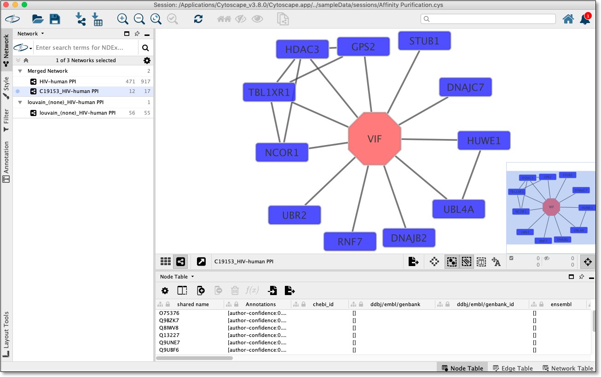

.. _quick-tutorial:

Quick Tutorial
==============

Open a network
--------------

To run Community Detection, a network must be loaded in Cytoscape.

From within Cytoscape click on **Affinity Purification** network
on the starter panel:

.. image:: images/quicktutorial/starterpanel.png
   :class: with-border with-shadow

If **not** displayed, the **Starter Panel** can
be displayed by invoking the menu option `View -> Show Starter Panel`.

   .. image:: images/quicktutorial/loadstarterpanel.png

Run Community Detection
-----------------------

With the network loaded click on `Apps -> Community Detection -> Run Community Detection` menu option.

.. image:: images/quicktutorial/runcommunitydetection.png
   :class: with-border with-shadow

The above step will display a dialog seen below.

Select **Louvain** from algorithm dropdown and
click **Run** button.

A new network/hierarchy should be generated as seen here (The current default layout will be used):

.. image:: images/quicktutorial/resultinghierarchy.png
   :class: with-border with-shadow

.. note::
   
   Each node in the network/hierarchy above represents a cluster
   with the members of that cluster set in the **CD_MemberList** node column

Perform Term Mapping
--------------------

Using network/hierarchy generated above select a few nodes
in the network view and then right click on a selected node to display the submenu
and select `Apps -> Community Detection -> Run Functional Enrichment`
as seen here:

The above step will display a dialog seen below:

Select **gProfiler** from algorithm dropdown and click
**Run** button.

.. image:: images/quicktutorial/term_map_dialog.png
   :class: with-border with-shadow

**gProfiler** will be run and nodes will be named and
colored according to overlap as seen here:

View Interactions
-----------------

Using network/hierarchy generated above select a **single**
node in the network view and then right click on the
selected node to display the submenu and select
`Apps -> Community Detection -> View Interactions for Selected Node`

.. image:: images/quicktutorial/view_interactions_invoke.png
   :class: with-border with-shadow

Invoking this menu option will show all the nodes pertaining to this cluster
in the parent network like as seen here:

Tally Attributes on Hierarchy
-------------------------------

With a CDAPS hierarchy network (as generated via `Run Community Detection`_ step above) 
click on `Apps -> Community Detection -> Tally Attributes on Hierarchy` menu option.

The above step will display a dialog seen below.

Select one or more columns from parent network to tally on hierarchy network and
click **OK** button. (only columns of type Integer, Boolean, or Double will be listed)

New corresponding columns will be added to the hierarchy network node table as seen
below.

.. image:: images/quicktutorial/resultingtallycols.png
   :class: with-border with-shadow

These new columns match the names of the columns selected in the dialog, but with the
namespace **CommunityDetectionTally** prefixed.

In addition, a **CommunityDetectionTally**::**Unmatched** column will also be added.

.. note::

   These columns can be used to create charts on each node as described
   `here <http://manual.cytoscape.org/en/stable/Styles.html?highlight=pie%20chart#tutorial-6-creating-node-charts>`_

Example hierarchy network styled with 
`node charts <http://manual.cytoscape.org/en/stable/Styles.html?highlight=pie%20chart#tutorial-6-creating-node-charts>`_:

.. image:: images/quicktutorial/resultingtallypiechart.png
   :class: with-border with-shadow

For more information click: :ref:`Tally Attributes on Hierarchy <tally-attributes-on-hierarchy>`

