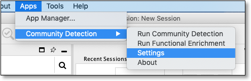
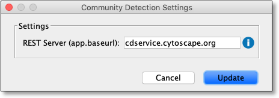

Settings
========

CDAPS allows user configuration via **two** methods.

The first method
----------------

User configurable options can be changed via a dialog built into
CDAPS. This can be found by clicking on the Cytoscape menu as follows:

``Apps -> Community Detection -> Settings``

Doing the above will display a dialog as seen here:

Currently the only setting that can be changed is to set
an alternate CDAPS REST Server which is the server that
runs the community detection and functional enrichment (term mapping)
algorithms.

.. note::
  To reset back to the default server just
  remove all text from this field and click **Update**

The second method
-----------------

.. warning:: This is for advanced users only and may cause
             CDAPS to fail and/or to use excessive CPU and
             network fail

``Edit -> Preferences -> Properties``

In the dialog that appears, CDAPS configuration can be found by
selecting ``CyCommunityDetection`` from dropdown menu.