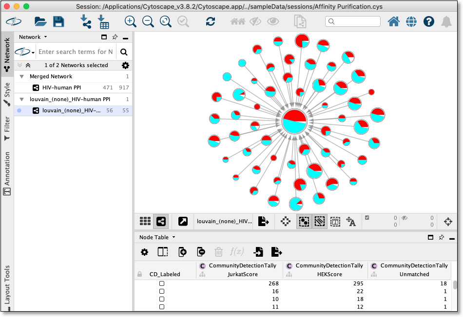

.. _tally-attributes-on-hierarchy:

Tally Attributes on Hierarchy
===============================

The menu option `Apps -> Community Detection -> Tally Attributes in Hierarchy` 
provides a way to annotate the hierarchy network created when running a Community 
Detection algorithm from this App. 

Example of `Apps -> Community Detection -> Tally Attributes in Hierarchy` styled with 
`node charts <http://manual.cytoscape.org/en/stable/Styles.html?highlight=pie%20chart#tutorial-6-creating-node-charts>`_

More specifically, `Apps -> Community Detection -> Tally Attributes in Hierarchy` menu 
option provides a way to count the number of members in each hierarchy network node 
that have a `true/positive` value for a specified set of attributes/columns in 
the parent network. 

.. note::

   Members of of a hierarchy node cluster are set in the node CD_MemberList column as
   a space delimited string of parent node names

These counts are stored as new columns/attributes on the 
hierarchy network with the same name as seen in the parent network, but prefixed with 
**CommunityDetectionTally** namespace.

In addition, any members in the hierarchy 
cluster that do **NOT** match any of the specified set of attributes/columns are 
counted in the **Unmatched** column/attribute.  

.. warning::

      For attribute(s)/column(s) of type **Double**, the value is rounded to nearest 
      integer before checking to see if the value is positive

To Run
-------

Select a hierarchy network created by CDAPS in Cytoscape and click on 
`Apps -> Community Detection -> Tally Attributes on Hierarchy` menu option.

