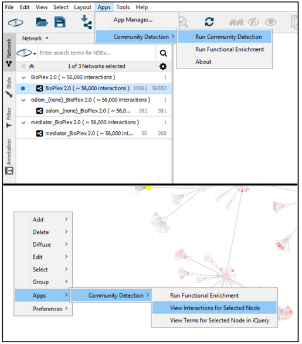
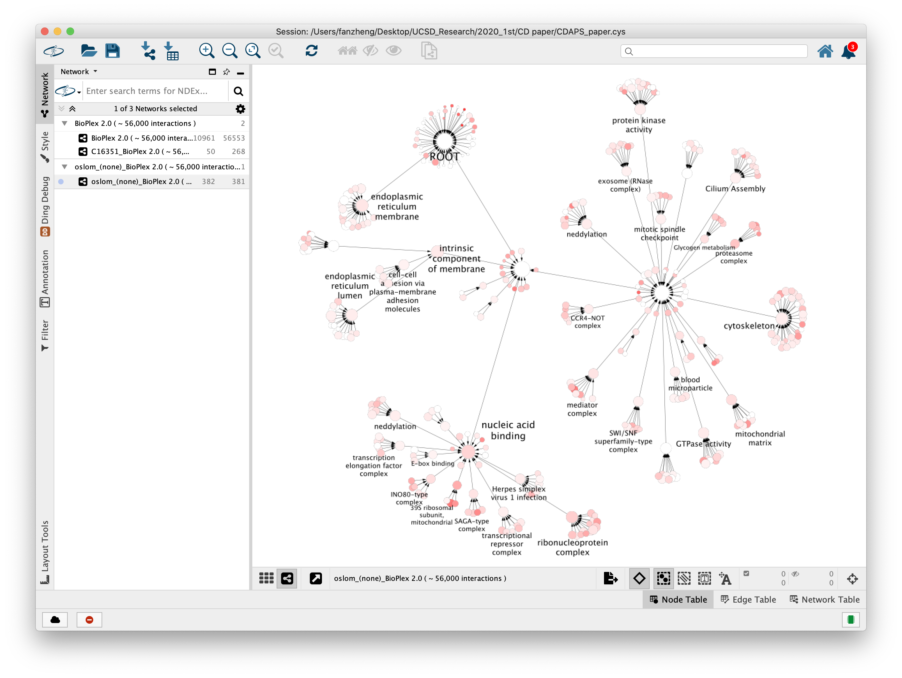

.. Community Detection APplication and Service (CDAPS) documentation master file

CDAPS
===============================================================================

Community Detection APplication and Service (CDAPS)

CDAPS performs multiscale community detection and
functional enrichment for network analysis
through a service-oriented architecture.
These features are provided by integrating
popular community detection algorithms and
enrichment tools. All the algorithms and
tools run remotely on a dedicated server.

Currently supported features:

* Community detection algorithms: `Louvain <https://github.com/idekerlab/cdlouvain>`_, `Infomap <https://github.com/idekerlab/cdinfomap>`_, `OSLOM <https://github.com/idekerlab/cdoslom>`_, `CliXO <https://github.com/idekerlab/cdclixo>`_, `HiDeF <https://github.com/idekerlab/cdhidef>`_
* Functional enrichment tools: `g:Profiler <https://github.com/idekerlab/cdgprofilergenestoterm>`_, `Enrichr <https://github.com/idekerlab/cdenrichrgenestoterm>`_, `iQuery <https://github.com/idekerlab/cdiquerygenestoterm>`_

Feature Requests and Reporting Bugs
-----------------------------------

The CDAPS GitHub issue tracker can be used to report a bug or request a feature.

To Report a bug:

* Go to https://github.com/cytoscape/cy-community-detection/issues
* Click on *New Issue*
* Write a short description of the issue. It is very helpful to provide a series of steps
  that can be taken to reproduce the issue.
* If possible attach a session file (.cys) or example input files.
* Enter App version, Cytoscape version and operating system.
* Click on *Submit new issue*

Cite CDAPS
-----------

Singhal A, Cao S, Churas C, Pratt D, Fortunato S, Zheng F, et al. (2020) Multiscale community detection in Cytoscape. PLoS Comput Biol 16(10): e1008239. https://doi.org/10.1371/journal.pcbi.1008239

.. toctree::
   :maxdepth: 2
   :caption: Contents
   :hidden:

   Installation
   WhatsNew
   QuickTutorial
   TallyAttributes
   Columns
   Settings

.. toctree::
   :maxdepth: 2
   :caption: Links:
   :hidden:

   Cytoscape.org <https://cytoscape.org>
   Cytoscape App Store <https://apps.cytoscape.org/apps/cycommunitydetection>
   Idekerlab.ucsd.edu <https://idekerlab.ucsd.edu/>
   GitHub <https://github.com/cytoscape/cy-community-detection>

